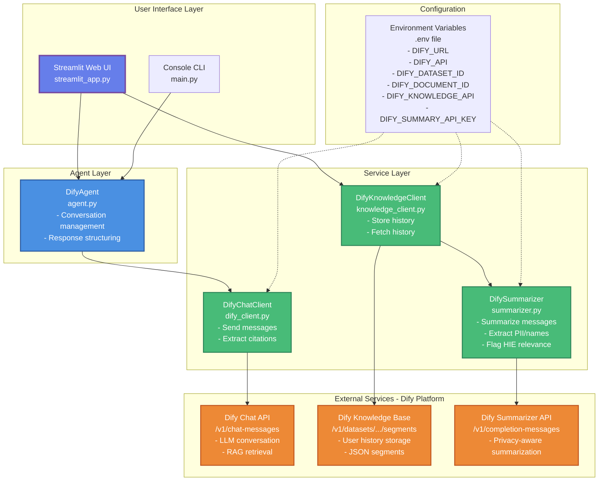
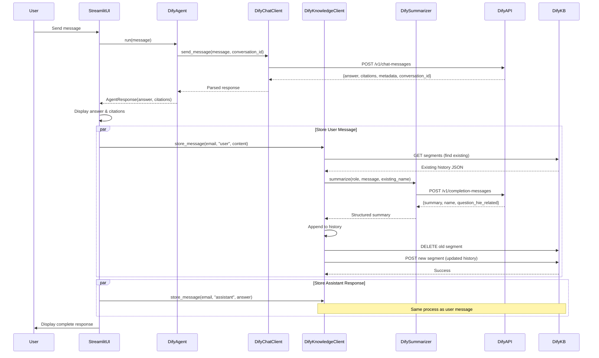
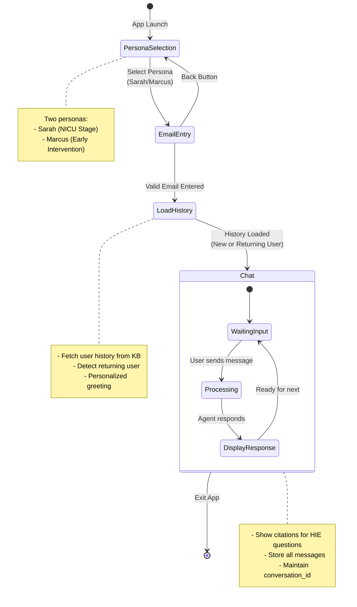
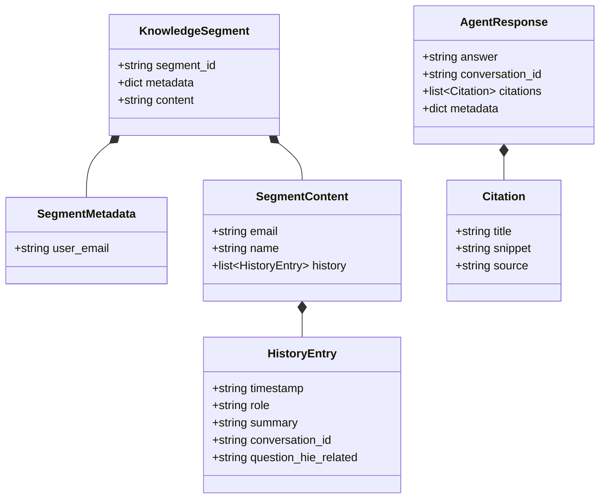
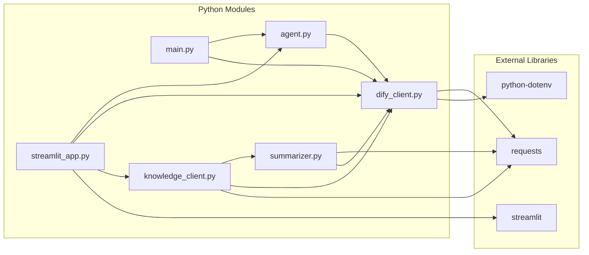
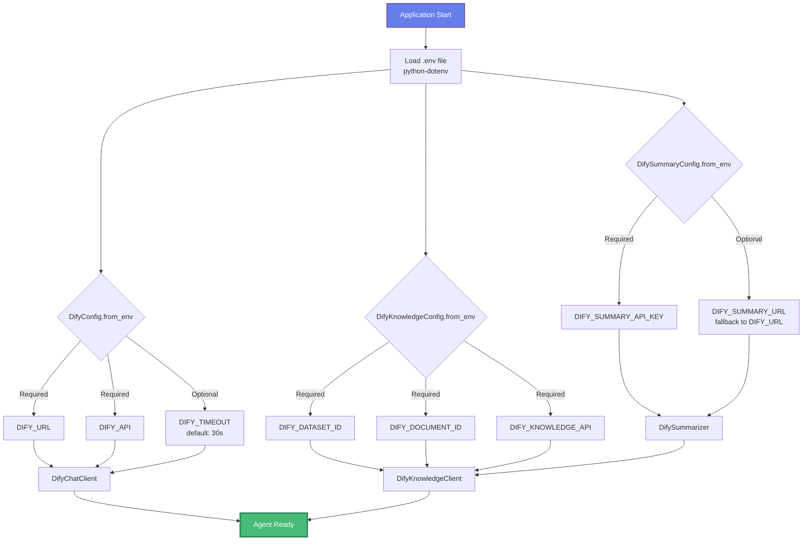
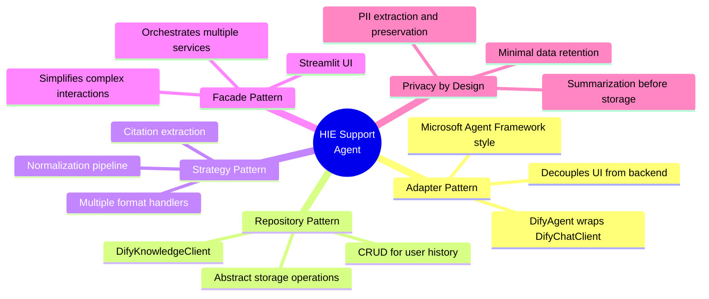

# HIE Support Agent - Architecture Diagram

## System Architecture Overview

## Data Flow - User Message Journey

## User Experience Flow - Streamlit UI

## Data Model - Knowledge Base Storage

## Component Dependencies

## Configuration Flow

## Key Design Patterns

---

## Legend

- **Purple/Blue**: User Interface Components
- **Blue**: Agent Layer (Business Logic)
- **Green**: Service Layer (Integrations)
- **Orange**: External Dify Platform APIs
- **Dashed Lines**: Configuration Dependencies
- **Solid Lines**: Direct Dependencies/Calls

